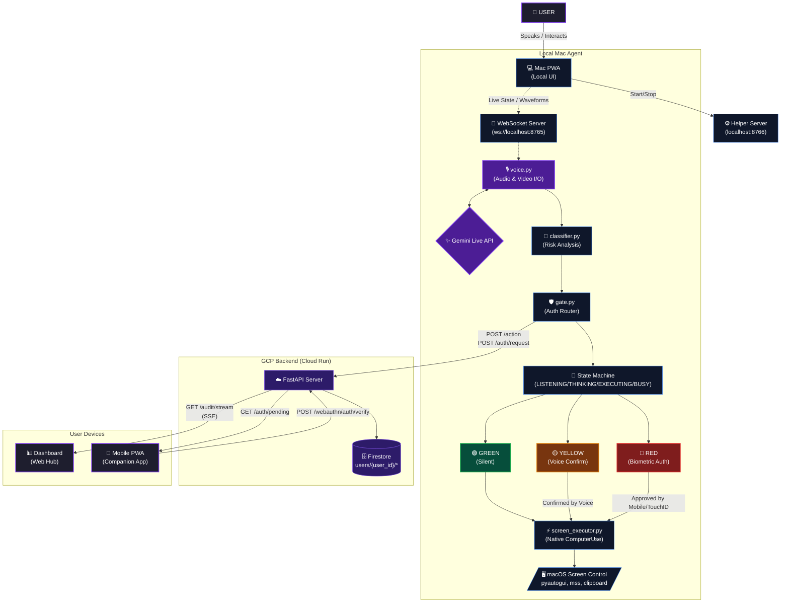

# ◈ Aegis
### Trust infrastructure for the agentic era.

[Live Demo](https://aegis.projectalpha.in) · 
[Mac App](https://aegismac.projectalpha.in) · 
[Dashboard](https://aegisdashboard.projectalpha.in) ·
[Setup](https://aegis.projectalpha.in/setup)

Built for the Gemini Live Agent Challenge

## What is Aegis

Aegis is a voice-controlled, biometric-secured AI agent for macOS that controls the screen using the Gemini Live API with native ComputerUse. It acts as a "Trusted Pilot" for your computer, enforcing a strict security boundary by classifying every agentic action into three risk tiers: Silent (Green), Confirm (Yellow), and Biometric (Red).

By combining real-time vision (continuous delta-based screenshot streaming) with a robust state machine (LISTENING/THINKING/EXECUTING/BUSY), Aegis executes multi-step tasks autonomously while ensuring sensitive operations—like deleting files or sending emails—cannot be executed without explicit user consent via native Touch ID on the Mac or Face ID on a companion mobile app.

## The Three-Tier Security Model

| Tier | Actions | Auth Required |
| --- | --- | --- |
| 🟢 GREEN | Read-only / Navigation | None |
| 🟡 YELLOW | UI Interaction / Creation | Voice confirmation |
| 🔴 RED | Irreversible / Sensitive | Touch ID / Face ID |

## Architecture

Aegis utilizes a high-speed duplex stream of audio and video with the Gemini Live API, managed by a dedicated state machine.



## Tech Stack

| Component | Technology |
| --- | --- |
| Voice & Vision | Gemini Live API |
| AI Model | Gemini 2.5 Flash |
| Desktop Control | Native ComputerUse (pyautogui + mss) |
| Biometric (Mac) | macOS LocalAuthentication (pyobjc) |
| Biometric (iPhone) | WebAuthn / Face ID |
| Backend | FastAPI on GCP Cloud Run |
| Database | GCP Firestore |
| Mac App | React PWA |
| Mobile App | React PWA |
| Dashboard | React + SSE |

## Demo Scenario

Aegis can execute complex, multi-step tasks autonomously. For example:
> "Open the Gemini Live Agent Challenge page and paste the rules into a new Google Doc."

Aegis will:
1.  Open Chrome and navigate to the challenge page.
2.  Extract the rules from the page.
3.  Open a new Google Doc.
4.  Paste the rules and name the document.
5.  All while gating the final "Create" or "Save" actions behind your preferred security tier.

## Quick Start (5 minutes)

1. Visit [aegis.projectalpha.in/setup](https://aegis.projectalpha.in/setup)
2. Enter your API keys and set your AEGIS_PIN.
3. Run the install command.
4. Start the local helper server: `python3 -m aegis.helper_server`
5. Open [aegismac.projectalpha.in](https://aegismac.projectalpha.in) and start talking.

## Project Structure

```text
gemini-live-hackathon/
├── aegis/                 # Python agent core handling Gemini Live, Vision, and native Screen Control
│   ├── screen/            # Low-level drivers for cursor, typing, and capture
│   ├── classifier.py      # Risk tier analysis
│   ├── gate.py            # Security gateway and auth routing
│   ├── voice.py           # Real-time multimodal orchestration
│   └── screen_executor.py # Native ComputerUse execution
├── backend/               # FastAPI backend for audit logging, auth requests, and WebAuthn
├── dashboard/             # Remote React web dashboard for real-time monitoring
├── guides/                # Documentation for architecture and migration
├── mac-app/               # Local React UI for macOS (Voice visualizer & status)
├── mobile-app/            # Companion PWA for remote biometric verification
├── aegis_menubar.py       # macOS native menu bar utility
├── architecture.mermaid   # System architecture diagram
├── install.sh             # Automated installation script
└── main.py                # Agent entry point
```

## Live Deployments

| Service | URL |
| --- | --- |
| Landing | [https://aegis.projectalpha.in](https://aegis.projectalpha.in) |
| Dashboard | [https://aegisdashboard.projectalpha.in](https://aegisdashboard.projectalpha.in) |
| Mac App | [https://aegismac.projectalpha.in](https://aegismac.projectalpha.in) |
| Mobile App | [https://aegismobile.projectalpha.in](https://aegismobile.projectalpha.in) |
| API | [https://apiaegis.projectalpha.in](https://apiaegis.projectalpha.in) |

## Built By

Harshit Singh Bhandari

Built for the Gemini Live Agent Challenge — March 2026
