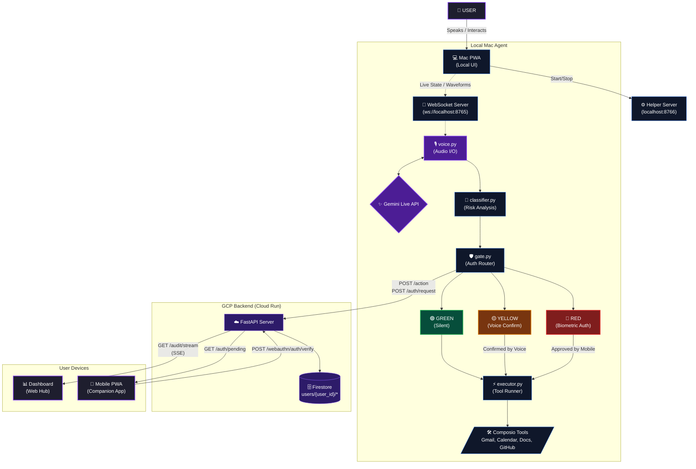

# ◈ Aegis
### The trust layer for AI agents.

[Live Demo](https://aegis.projectalpha.in) · 
[Mac App](https://aegismac.projectalpha.in) · 
[Dashboard](https://aegisdashboard.projectalpha.in) ·
[Setup](https://aegis.projectalpha.in/setup)

Built for the Gemini Live Agent Challenge

## What is Aegis

Aegis is an AI agent that controls a macOS environment using the Gemini Live API and Composio tools while enforcing a strict security boundary. The core concept revolves around classifying every agentic action into three risk tiers: Silent (Green), Confirm (Yellow), and Biometric (Red), ensuring that sensitive operations cannot be executed without explicit user consent.

By analyzing the action context and screen state, Aegis prevents unauthorized or unintended operations. It gates high-risk actions behind native Touch ID on the Mac or Face ID on a companion mobile application, creating a secure bridge between autonomous AI capabilities and user verification. This resolves the fundamental trust problem with autonomous agents, empowering users to delegate complex tasks without relinquishing ultimate control over irreversible actions.

## The Three-Tier Security Model

| Tier | Actions | Auth Required |
| --- | --- | --- |
| 🟢 GREEN | Read-only | None |
| 🟡 YELLOW | Creates & modifies | Voice confirmation |
| 🔴 RED | Irreversible | Touch ID / Face ID |

## Architecture



## Tech Stack

| Component | Technology |
| --- | --- |
| Voice | Gemini Live API |
| AI Model | Gemini 2.5 Flash |
| Tools | Composio |
| Biometric (Mac) | macOS LocalAuthentication (pyobjc) |
| Biometric (iPhone) | WebAuthn / Face ID |
| Backend | FastAPI on GCP Cloud Run |
| Database | GCP Firestore |
| Mac App | React PWA |
| Mobile App | React PWA |
| Dashboard | React + SSE |

## Quick Start (5 minutes)

1. Visit [aegis.projectalpha.in/setup](https://aegis.projectalpha.in/setup)
2. Enter your API keys
3. Run the install command
4. Open [aegismobile.projectalpha.in](https://aegismobile.projectalpha.in) on iPhone
5. Start talking

## Manual Setup

For developers who want to run locally:

```bash
git clone https://github.com/harshitsinghbhandari/gemini-live-hackathon
cd gemini-live-hackathon
cp .env.example .env
# Fill in your keys
pip install -r requirements.txt
python aegis/helper_server.py
# Open aegismac.projectalpha.in
```

## Environment Variables

| Variable | Description | Where to get |
| --- | --- | --- |
| `GOOGLE_API_KEY` | Gemini API key | [aistudio.google.com](https://aistudio.google.com) |
| `COMPOSIO_API_KEY` | Composio API key | [app.composio.dev](https://app.composio.dev) |
| `USER_ID` | Your unique Aegis ID | Choose any username |
| `COMPOSIO_USER_ID` | Composio user ID | Same as USER_ID |
| `DEVICE_ID` | Your Mac identifier | e.g. your-name-macbook |
| `BACKEND_URL` | Backend API URL | `https://apiaegis.projectalpha.in` |

## Supported Tools

Aegis supports 7 core toolkits through Composio, strictly categorized by our security tier model:

- **Gmail**: Read emails and threads (GREEN); Create drafts and reply to threads (YELLOW); Send, delete, or trash emails (RED).
- **Google Calendar**: List and get events (GREEN); Create and update events (YELLOW); Delete events (RED).
- **Google Docs**: Read documents (GREEN); Create and edit documents (YELLOW); Delete content or export (RED).
- **Google Sheets**: Read rows and worksheets (GREEN); Add rows, columns, and format cells (YELLOW); Clear values or delete sheets (RED).
- **Google Slides**: View presentations and slides (GREEN); Create presentations from templates (YELLOW); Batch update or delete (RED).
- **Google Tasks**: List and read tasks/lists (GREEN); Insert or update tasks and lists (YELLOW); Delete or clear tasks/lists (RED).
- **GitHub**: List issues, PRs, and commits (GREEN); Create issues, add labels/assignees, review PRs (YELLOW); Merge PRs or delete repositories (RED).

## Project Structure

```text
gemini-live-hackathon/
├── aegis/                 # Python agent core handling Gemini Live, classification, and execution
├── backend/               # FastAPI backend for audit logging, auth requests, and WebAuthn
├── dashboard/             # Remote React web dashboard for real-time monitoring and setup
├── landing/               # Static landing page served via Docker and Nginx
├── mac-app/               # Local React UI for macOS providing voice viz and local auth overlays
├── mobile-app/            # Companion PWA for iOS serving as remote Face ID verification
├── scripts/               # Utility scripts including Firestore schema migration
├── aegis_menubar.py       # macOS native menu bar utility for controlling the agent
├── architecture.mermaid   # Mermaid DSL for architecture diagram
├── install.sh             # Automated single-command installation script
└── requirements.txt       # Python dependencies for the core agent and backend
```

## Live Deployments

| Service | URL |
| --- | --- |
| Landing | [https://aegis.projectalpha.in](https://aegis.projectalpha.in) |
| Dashboard | [https://aegisdashboard.projectalpha.in](https://aegisdashboard.projectalpha.in) |
| Mac App | [https://aegismac.projectalpha.in](https://aegismac.projectalpha.in) |
| Mobile App | [https://aegismobile.projectalpha.in](https://aegismobile.projectalpha.in) |
| API | [https://apiaegis.projectalpha.in](https://apiaegis.projectalpha.in) |

## Built By

Harshit Singh Bhandari

Built for the Gemini Live Agent Challenge — March 2026