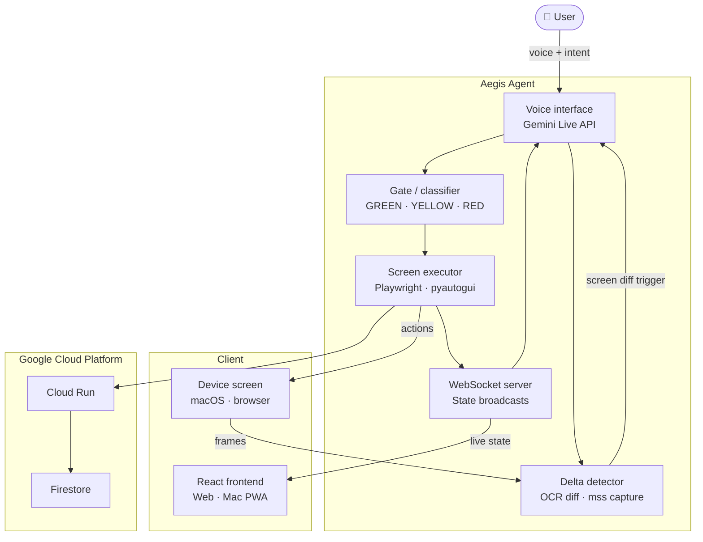
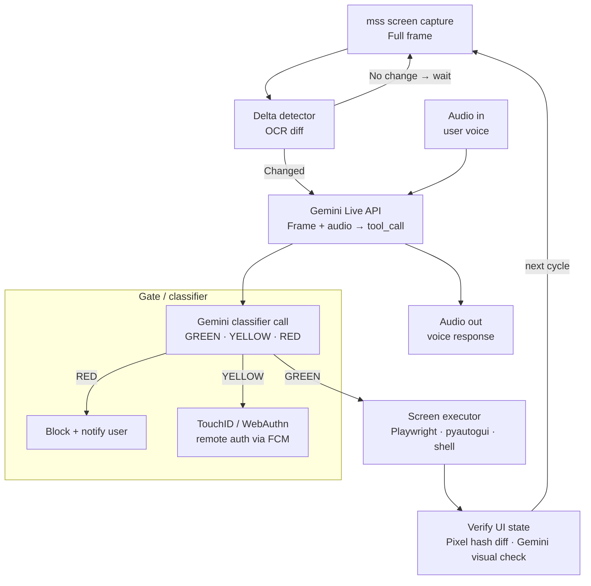
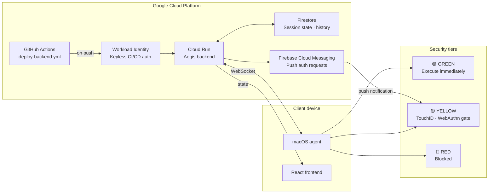

# Aegis — Architecture Diagrams

## Figure 1 — System Overview

```mermaid
flowchart TB
    User(["👤 User"])

    subgraph AEGIS ["Aegis Agent"]
        direction TB
        VI["Voice interface<br>Gemini Live API"]
        GC["Gate / classifier<br>GREEN · YELLOW · RED"]
        SE["Screen executor<br>Playwright · pyautogui"]
        DD["Delta detector<br>OCR diff · mss capture"]
        WS["WebSocket server<br>State broadcasts"]

        VI --> GC --> SE
        VI --> DD
        WS --> VI
        SE --> WS
    end

    User -->|voice + intent| VI
    DD -->|screen diff trigger| VI

    subgraph CLIENT ["Client"]
        FE["React frontend<br>Web · Mac PWA"]
        SCREEN["Device screen<br>macOS · browser"]
    end

    WS -->|live state| FE
    SE -->|actions| SCREEN
    SCREEN -->|frames| DD

    subgraph GCP ["Google Cloud Platform"]
        CR["Cloud Run"]
        FS["Firestore"]
    end

    SE --> CR
    CR --> FS
```

---

## Figure 2 — Gemini Live Streaming & Agent Action Pipeline

```mermaid
flowchart TD
    CAP["mss screen capture<br>Full frame"]
    DD["Delta detector<br>OCR diff"]
    CAP --> DD

    DD -- "No change → wait" --> CAP

    DD -- "Changed" --> GEMINI

    AIN["Audio in<br>user voice"]
    GEMINI["Gemini Live API<br>Frame + audio → tool_call"]
    AOUT["Audio out<br>voice response"]

    AIN --> GEMINI
    GEMINI --> AOUT

    GEMINI --> GATE

    subgraph GATE_BLOCK ["Gate / classifier"]
        GATE["Gemini classifier call<br>GREEN · YELLOW · RED"]
        RED["Block + notify user"]
        YELLOW["TouchID / WebAuthn<br>remote auth via FCM"]
        GATE -- "RED" --> RED
        GATE -- "YELLOW" --> YELLOW
    end

    GATE -- "GREEN" --> EXEC

    EXEC["Screen executor<br>Playwright · pyautogui · shell"]
    VERIFY["Verify UI state<br>Pixel hash diff · Gemini visual check"]

    EXEC --> VERIFY
    VERIFY -- "next cycle" --> CAP
```

---

## Figure 3 — GCP Architecture & Security Model

```mermaid
flowchart LR
    subgraph GCP ["Google Cloud Platform"]
        CR["Cloud Run<br>Aegis backend"]
        FS["Firestore<br>Session state · history"]
        FCM["Firebase Cloud Messaging<br>Push auth requests"]
        WI["Workload Identity<br>Keyless CI/CD auth"]
        GHA["GitHub Actions<br>deploy-backend.yml"]

        CR <--> FS
        CR --> FCM
        GHA -- "on push" --> WI --> CR
    end

    subgraph TIERS ["Security tiers"]
        GREEN["🟢 GREEN<br>Execute immediately"]
        YELLOW["🟡 YELLOW<br>TouchID · WebAuthn gate"]
        RED["🔴 RED<br>Blocked"]
    end

    subgraph CLIENT ["Client device"]
        AGENT["macOS agent"]
        FE["React frontend"]
    end

    CR <-->|WebSocket| AGENT
    CR -->|state| FE
    FCM -->|push notification| YELLOW
    AGENT --> GREEN
    AGENT --> YELLOW
    AGENT --> RED
```