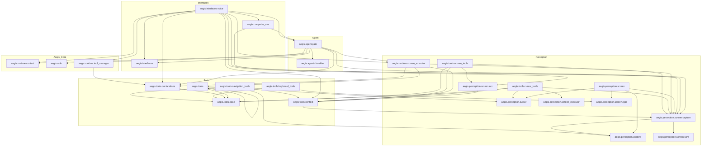

```mermaid
graph TD
  subgraph Interfaces
    aegis_interfaces_voice["aegis.interfaces.voice"]
    aegis_interfaces["aegis.interfaces"]
    aegis_computer_use["aegis.computer_use"]
  end
  subgraph Perception
    aegis_perception_screen_capture["aegis.perception.screen.capture"]
    aegis_tools_cursor_tools["aegis.tools.cursor_tools"]
    aegis_perception_cursor["aegis.perception.cursor"]
    aegis_perception_window["aegis.perception.window"]
    aegis_perception_screen_executor["aegis.perception.screen_executor"]
    aegis_runtime_screen_executor["aegis.runtime.screen_executor"]
    aegis_perception_screen["aegis.perception.screen"]
    aegis_perception_screen_type["aegis.perception.screen.type"]
    aegis_tools_screen_tools["aegis.tools.screen_tools"]
    aegis_perception_screen_ocr["aegis.perception.screen.ocr"]
    aegis_perception_screen_som["aegis.perception.screen.som"]
  end
  subgraph Tools
    aegis_tools["aegis.tools"]
    aegis_tools_base["aegis.tools.base"]
    aegis_tools_declarations["aegis.tools.declarations"]
    aegis_tools_keyboard_tools["aegis.tools.keyboard_tools"]
    aegis_tools_navigation_tools["aegis.tools.navigation_tools"]
    aegis_tools_context["aegis.tools.context"]
  end
  subgraph Agent
    aegis_agent_gate["aegis.agent.gate"]
    aegis_agent_classifier["aegis.agent.classifier"]
  end
  subgraph Aegis_Core
    aegis_runtime_context["aegis.runtime.context"]
    aegis_auth["aegis.auth"]
    aegis_runtime_tool_manager["aegis.runtime.tool_manager"]
  end
  aegis_agent_gate --> aegis_agent_classifier
  aegis_agent_gate --> aegis_auth
  aegis_agent_gate --> aegis_interfaces
  aegis_agent_gate --> aegis_perception_screen_capture
  aegis_agent_gate --> aegis_runtime_context
  aegis_agent_gate --> aegis_runtime_screen_executor
  aegis_agent_gate --> aegis_tools_declarations
  aegis_computer_use --> aegis_agent_gate
  aegis_computer_use --> aegis_perception_screen_capture
  aegis_interfaces_voice --> aegis_agent_gate
  aegis_interfaces_voice --> aegis_computer_use
  aegis_interfaces_voice --> aegis_interfaces
  aegis_interfaces_voice --> aegis_perception_screen_capture
  aegis_interfaces_voice --> aegis_perception_screen_ocr
  aegis_interfaces_voice --> aegis_runtime_context
  aegis_interfaces_voice --> aegis_runtime_screen_executor
  aegis_interfaces_voice --> aegis_runtime_tool_manager
  aegis_interfaces_voice --> aegis_tools_context
  aegis_interfaces_voice --> aegis_tools_declarations
  aegis_perception_screen --> aegis_perception_cursor
  aegis_perception_screen --> aegis_perception_screen_capture
  aegis_perception_screen --> aegis_perception_screen_type
  aegis_perception_screen --> aegis_perception_window
  aegis_perception_screen_capture --> aegis_perception_screen_som
  aegis_perception_screen_capture --> aegis_perception_window
  aegis_perception_screen_ocr --> aegis_tools_context
  aegis_runtime_screen_executor --> aegis_perception_screen_capture
  aegis_runtime_screen_executor --> aegis_tools
  aegis_runtime_screen_executor --> aegis_tools_context
  aegis_runtime_screen_executor --> aegis_tools_declarations
  aegis_runtime_tool_manager --> aegis_tools_declarations
  aegis_tools --> aegis_tools
  aegis_tools --> aegis_tools_base
  aegis_tools_context --> aegis_perception_screen_capture
  aegis_tools_cursor_tools --> aegis_perception_cursor
  aegis_tools_cursor_tools --> aegis_perception_screen_capture
  aegis_tools_cursor_tools --> aegis_perception_screen_executor
  aegis_tools_cursor_tools --> aegis_tools_base
  aegis_tools_cursor_tools --> aegis_tools_context
  aegis_tools_declarations --> aegis_tools_base
  aegis_tools_keyboard_tools --> aegis_perception_screen_type
  aegis_tools_keyboard_tools --> aegis_tools_base
  aegis_tools_navigation_tools --> aegis_perception_cursor
  aegis_tools_navigation_tools --> aegis_perception_window
  aegis_tools_navigation_tools --> aegis_tools_base
  aegis_tools_navigation_tools --> aegis_tools_context
  aegis_tools_screen_tools --> aegis_perception_screen_capture
  aegis_tools_screen_tools --> aegis_perception_screen_ocr
  aegis_tools_screen_tools --> aegis_tools_base
  aegis_tools_screen_tools --> aegis_tools_context
```
