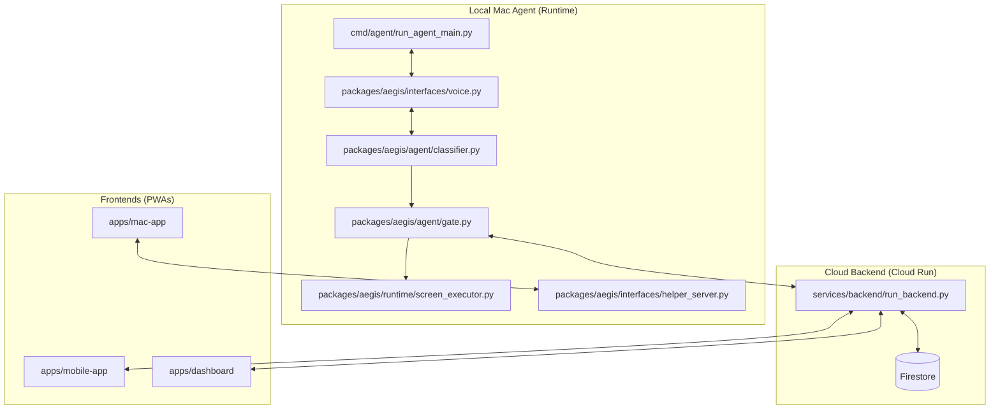

# Aegis Repository Map

Aegis is a **local-first, cloud-secured** trust infrastructure for AI agents. This map details the system's architecture, component relationships, and security model.

## 🏗️ System Architecture

Aegis operates as a hybrid system, combining local high-speed processing with cloud-based out-of-band authentication.

---

## 📂 Core Components

### 1. Local Mac Agent (`packages/aegis/`)
The core intelligence and execution engine.

*   **`voice.py`**: The multimodal hub. Manages duplex audio/video streaming to Gemini Live.
*   **`classifier.py`**: The security brain. Uses Gemini 2.5 Flash to assign risk tiers.
*   **`gate.py`**: The primary gatekeeper. Orchestrates the auth lifecycle.
*   **`screen_executor.py`**: The native driver. Executes screen actions via `pyautogui` and `mss`.
*   **`auth.py`**: Local biometric provider. Interfaces with macOS native Touch ID.

### 2. Cloud Backend (`services/backend/`)
The decentralized security anchor.

*   **`run_backend.py`**: FastAPI server handling WebAuthn, auth requests, and audit logs.
*   **`firestore.py`**: Real-time data layer for syncing auth state.
*   **`fcm.py`**: Push notification service for triggering mobile biometrics.

### 3. Frontends (`apps/`)
*   **`mac-app`**: Local interface for waveforms and agent status.
*   **`mobile-app`**: Companion app for out-of-band biometric (Face ID/WebAuthn).
*   **`dashboard`**: Centralized audit hub for reviewing actions.

---

## 🛡️ Three-Tier Security Model

| Tier | Sensitivity | Requirement |
| :--- | :--- | :--- |
| **🟢 GREEN** | Low | Silent Execution |
| **🟡 YELLOW** | Medium | Voice Confirmation |
| **🔴 RED** | High | Biometric (Touch ID/Face ID) |

---

## 🔄 Execution Flow

1.  **Perception**: `voice.py` streams screenshots and audio.
2.  **Intent**: Gemini issues a tool call.
3.  **Classification**: `classifier.py` assigns a tier.
4.  **Authorization**: Verbal (Yellow) or Biometric (Red) checks.
5.  **Action**: `screen_executor.py` performs the OS interaction.
6.  **Audit**: Every step is logged to Firestore and the Dashboard.
