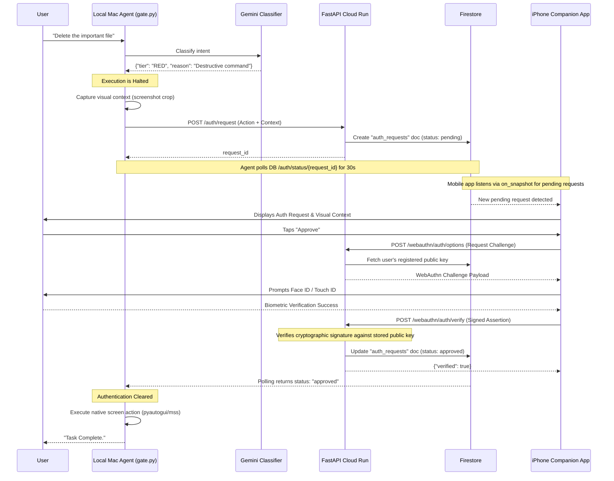

# Aegis Biometric Authentication Flow (WebAuthn)

Aegis uses WebAuthn to provide strong, out-of-band biometric authentication for "RED" (irreversible or sensitive) actions. This ensures that even if the desktop environment is compromised or the LLM hallucinates a dangerous command, the action cannot be executed without physical verification from a trusted device (like an iPhone using Face ID).

## The Sequence Diagram

This diagram illustrates the full flow from action proposal to verified execution.

## Step-by-Step Breakdown

### 1. Detection & Context Capture (`gate.py`)
When the `classifier.py` designates an action as RED, the `gate_action` function halts execution. It captures a downscaled screenshot crop representing the *visual context* of the proposed action (e.g., the specific file to be deleted).

### 2. The Auth Request
The local agent sends a `POST` request to the backend (`/auth/request`) containing the proposed action, the tier, the intended tool, and the visual context. The backend stores this in Firestore under the user's `auth_requests` collection with a `pending` status. The agent begins a 30-second polling loop against the backend to check the status.

### 3. Mobile Notification
The iPhone Companion App (PWA) is listening to the user's Firestore `auth_requests` collection using real-time listeners (`on_snapshot`). When it detects a new `pending` document, it alerts the user and displays the action details along with the visual context captured by the Mac.

### 4. The WebAuthn Challenge (`run_backend.py`)
If the user taps "Approve" on their phone:
1.  The mobile app calls `POST /webauthn/auth/options`. The backend retrieves the user's previously registered WebAuthn credential ID and public key from Firestore.
2.  The backend generates a cryptographic challenge and sends it to the phone.
3.  The iPhone's native OS prompts the user for Face ID (or Touch ID/Passcode).
4.  The secure enclave signs the challenge using the private key generated during initial registration.
5.  The mobile app sends the signed assertion back via `POST /webauthn/auth/verify`.

### 5. Verification and Execution
The backend (`verify_authentication_response`) validates the signature. If valid, it updates the Firestore document status to `approved`.
The local agent, polling the `/auth/status/{request_id}` endpoint, receives the `approved` status. It breaks out of the waiting loop and proceeds to execute the native screen action on the Mac.

## Fallback Mechanism
If the remote WebAuthn process times out (30 seconds) or fails, `gate.py` automatically falls back to requesting local Touch ID on the Mac itself using the `LocalAuthentication` framework via `pyobjc`.